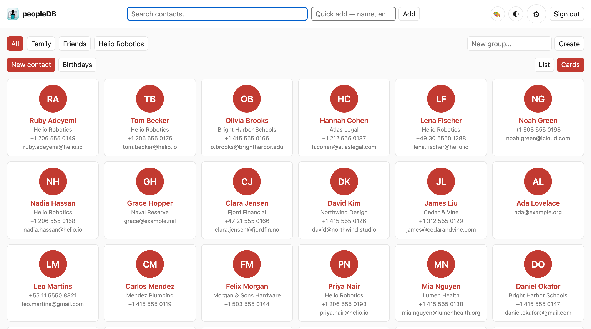
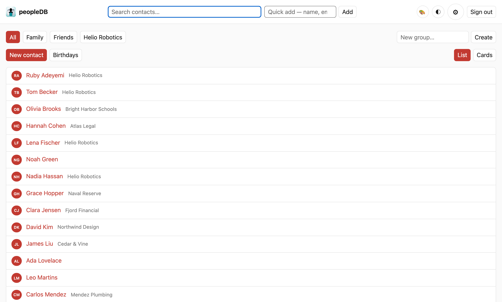
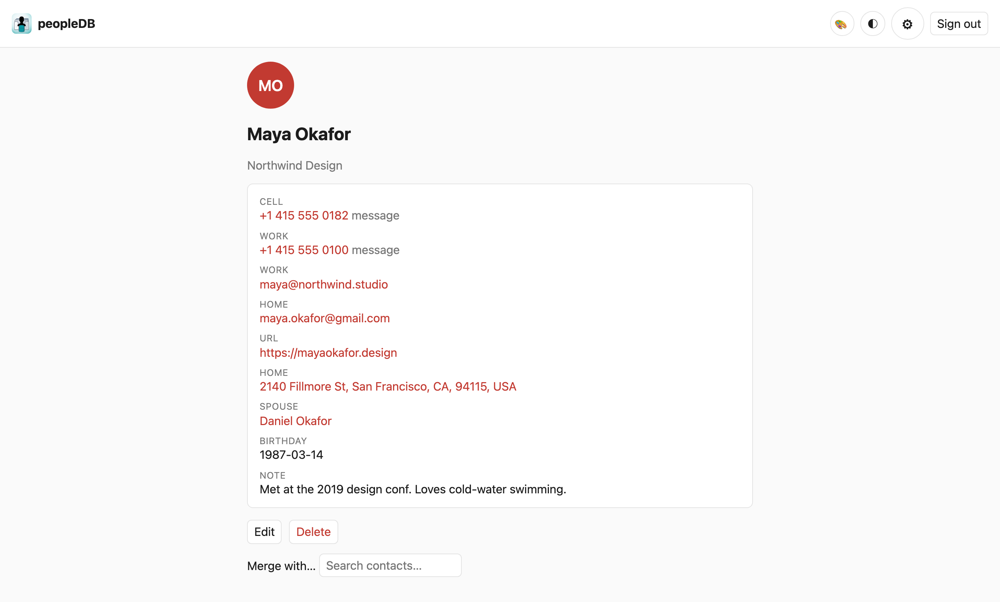
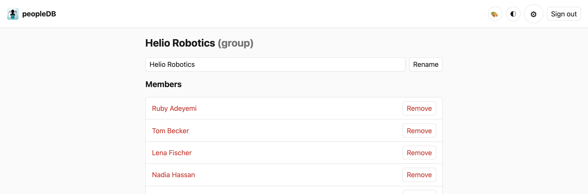
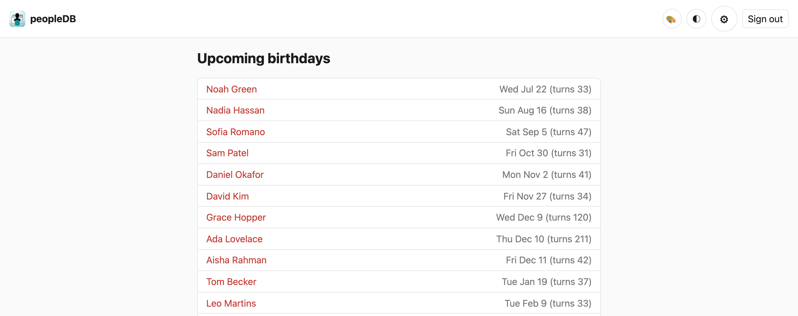

<p align="center">
  
</p>

<h1 align="center">peopleDB</h1>

A fast, friendly web client for a **CardDAV** address book (e.g. [Baikal](https://sabre.io/baikal/)):
browse, search, add, edit, and organise your contacts from any browser — phone, tablet, or desktop.
Your CardDAV server stays the source of truth; peopleDB keeps a disposable local cache so everything
feels instant.

Built with Python / FastAPI / HTMX — server-rendered, no JavaScript build step. It signs in with your
existing CardDAV credentials and shows each household member exactly what the server's permissions allow.



## Features

- **Sign in with your CardDAV account.** No separate user database — you log in with the same
  credentials as Apple Contacts or any other CardDAV client, and the server's permissions decide what
  you see. Households share one server; each person sees their own address books.
- **Browse your way.** Switch between a compact **list** and a roomier **card** view, choose which
  fields show in each, and tune theme, accent colour, and text size — all remembered per user.
- **Search as you type.** Instant full-text search across names, organisations, emails, phones, and
  notes.
- **Quick add.** Type one plain line — `Jane Rivera jane@acme.com +1 415 555 0134 bday 3 Mar #Family` —
  and peopleDB parses out the name, email, phone, birthday, and group, then drops you on a pre-filled
  form to review before saving. Nothing is written until you confirm.
- **Add, edit, and delete contacts** with changes written straight back to the server. Edits are
  etag-checked, so a simultaneous change from another device is surfaced, never silently overwritten.
  Anything peopleDB doesn't render itself — extra fields, social profiles, custom properties — is
  preserved untouched.
- **Contact photos.** View avatars and upload a new photo, with a crop step before it's saved.
- **One tap to reach people.** Emails, phone numbers, and addresses become `mailto:`, `tel:`, `sms:`,
  and map links.
- **Groups.** Create, rename, and delete groups and manage their members, then filter your contacts
  down to a group. Uses the same Apple group convention as macOS/iOS Contacts, so groups stay in sync
  both ways against the shared server.
- **Relationships.** Record spouse, parent, child, and other relationships; when the related person is
  also a contact, their name links straight to their card.
- **Merge duplicates.** Find likely duplicates of a contact, preview the merged result field by field,
  and combine them — group memberships and all — in one step.
- **Birthdays.** See who's coming up, and subscribe to a private calendar feed URL so birthdays appear
  in any calendar app.
- **Works when the server doesn't.** If the CardDAV server is unreachable, your cached contacts stay
  browsable behind a staleness banner. Writes fail loudly rather than silently queueing, so you always
  know what actually saved.

## Screenshots

| List & card views | Contact detail |
|---|---|
|  |  |
| **Groups** | **Upcoming birthdays** |
|  |  |

## How it works

Your CardDAV server is **canonical**. peopleDB reads from a local SQLite cache for speed and writes
straight through to the server, updating the cache from the server's response. The cache is entirely
disposable — delete it and it rebuilds on the next sync. Sessions live only in memory (your CardDAV
credentials are encrypted and never written to disk), so there's nothing sensitive at rest.

## Running

```sh
uv sync
PEOPLEDB_DAV_URL=https://dav.example.org/dav.php \
PEOPLEDB_SECRET_KEY=$(uv run python -c 'from cryptography.fernet import Fernet; print(Fernet.generate_key().decode())') \
uv run peopledb
```

Then open `http://localhost:8000` and sign in with your CardDAV username and password.

### Environment variables

| Variable | Required | Meaning |
|---|---|---|
| `PEOPLEDB_DAV_URL` | yes | Base URL of the CardDAV server (e.g. Baikal's `/dav.php`). |
| `PEOPLEDB_SECRET_KEY` | no | Fernet key encrypting session credentials in memory. **Empty → an ephemeral key is generated at startup, so every restart logs all users out.** Set a fixed key to keep sessions across restarts. |
| `PEOPLEDB_DB_PATH` | no | SQLite cache path (default `peopledb-cache.db`). Safe to delete; it's a mirror. |
| `PEOPLEDB_SYNC_INTERVAL` | no | Background refresh interval in seconds (default `300`). |
| `PEOPLEDB_WRITE_ADDRESSBOOK` | no | Which addressbook new contacts/groups are written to, matched by displayname or path segment (default `default`). Falls back to the first discovered if no match. |
| `PEOPLEDB_SECURE_COOKIES` | no | `0` to drop the `Secure` cookie flag for plain-HTTP localhost dev. Default (`1`) requires HTTPS. |

Never commit server URLs or credentials — pass them through the environment.

### Running with Docker

Images are built and published to GitHub Container Registry on every merge to `main`
(`ghcr.io/wildernessj/peopledb`) — see
[`docs/DECISIONS/ADR-0005-ghcr-github-actions-deploy.md`](docs/DECISIONS/ADR-0005-ghcr-github-actions-deploy.md).
Tags: `:latest` (tip of `main`), `:vX.Y.Z` (marked releases), `:sha-<short>` (any build, for pinning).

```sh
docker run -d --name peopledb -p 8000:8000 \
  -v peopledb-data:/data \
  -e PEOPLEDB_DAV_URL=https://dav.example.org/dav.php \
  -e PEOPLEDB_SECRET_KEY=$(docker run --rm ghcr.io/wildernessj/peopledb:latest python -c 'from cryptography.fernet import Fernet; print(Fernet.generate_key().decode())') \
  ghcr.io/wildernessj/peopledb:latest
```

Then open `http://<host>:8000`. Notes:

- The SQLite cache lives in the `/data` volume (`PEOPLEDB_DB_PATH` is preset to
  `/data/peopledb-cache.db`); the named volume keeps it across restarts.
- Set a fixed `PEOPLEDB_SECRET_KEY` (as above) so sessions survive restarts —
  omit it and every restart logs all users out.
- Serving over plain HTTP (no TLS in front)? Add `-e PEOPLEDB_SECURE_COOKIES=0`,
  or the session cookie won't be sent and login will appear to fail.
- Images are `linux/amd64`. To build locally instead of pulling: `docker build -t peopledb .`
  (add `--platform linux/amd64` when building on Apple Silicon for an amd64 host).

See the env-var table above for the rest.

#### Unraid

`unraid/peopledb.xml` is a Docker-tab template — add it via **Add Container** (or drop it in
`/boot/config/plugins/dockerMan/templates-user/`), fill `PEOPLEDB_DAV_URL` and a fixed
`PEOPLEDB_SECRET_KEY`, and start. A new `:latest` then shows "update ready" in the Docker tab; roll back
by pointing the repository at a `:sha-…` or `:vX.Y.Z` tag.

Two things that bite on a fresh Unraid deploy:

- **The `/data` (appdata) path must be writable by uid/gid `999`.** The container runs as the
  non-root `app` user (`999:999`). Unraid auto-creates a new bind path as `root`, so the app crashes
  on first boot with `sqlite3.OperationalError: unable to open database file`. Fix once:
  `chown -R 999:999 /mnt/user/appdata/peopledb`.
- **The default host port `8000` is a common collision** (Paperless-ngx, others publish it). If
  `docker` reports `Bind for 0.0.0.0:8000 failed: port is already allocated`, pick a free host port in
  the template's *WebUI Port* field — the container port stays `8000`.
- **Fronting it with a reverse proxy?** Put the container on the *same Docker network as the proxy*
  (not the default `bridge`) so the proxy can resolve it by container name, then proxy to
  `peopledb:8000` and set `PEOPLEDB_SECURE_COOKIES=1` (TLS terminates at the proxy).

## Development

```sh
uv run pytest            # unit tests
uv run pytest -m live    # end-to-end tests against a throwaway local Radicale
```

The design and the reasoning behind the non-obvious calls live in
[`docs/`](docs/) — start with [`docs/DECISIONS/`](docs/DECISIONS/) (architecture decision records) and
[`docs/PITFALLS.md`](docs/PITFALLS.md).

## License

[MIT](LICENSE).
